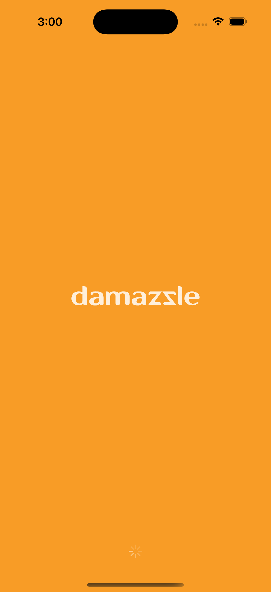
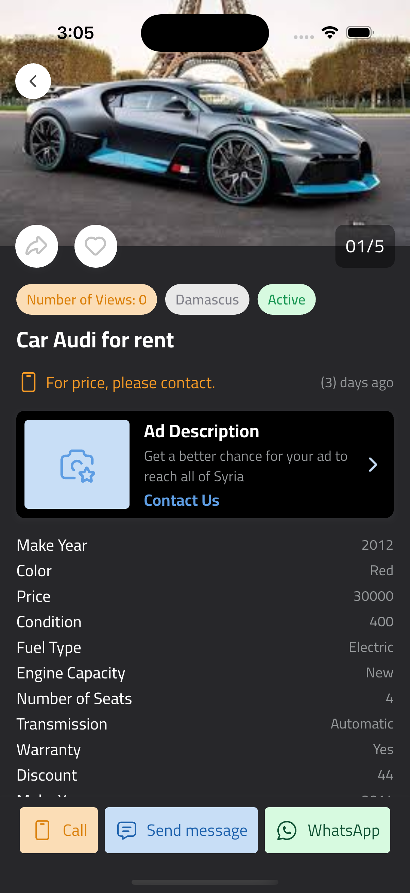
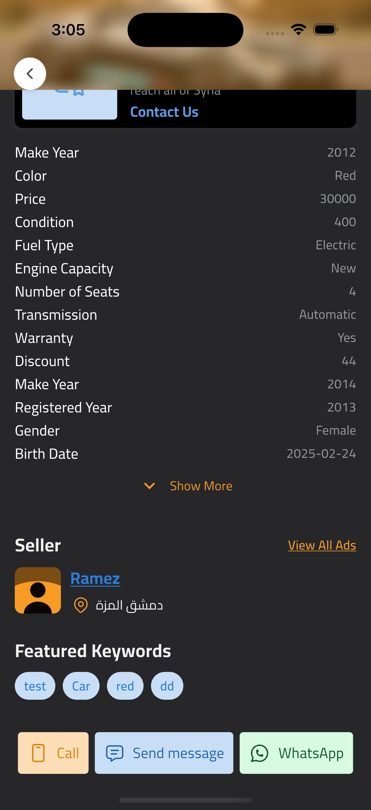
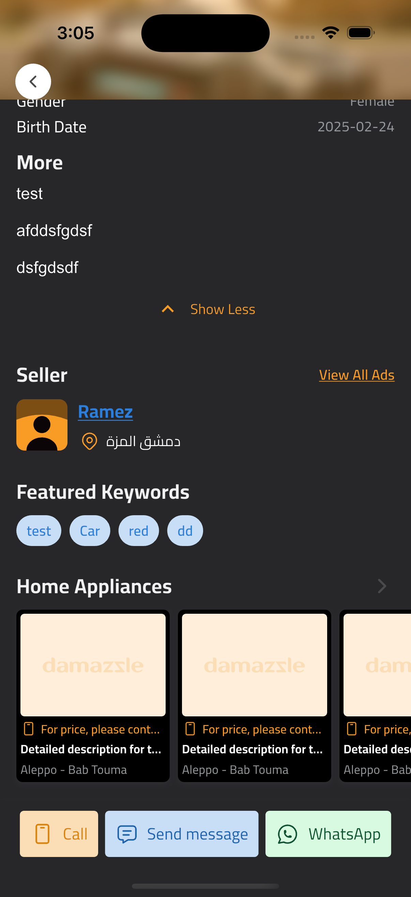
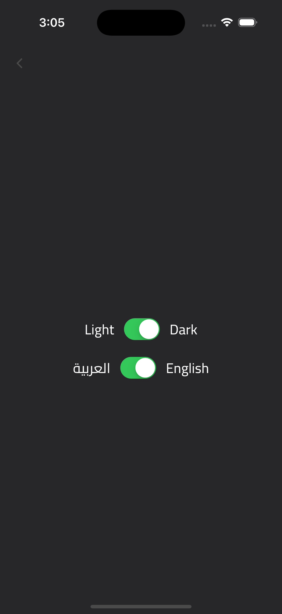

# Flutter Project Structure

This project follows a well-organized structure to ensure scalability, maintainability, and
separation of concerns. Below is an overview of the project structure and how to set it up.

---

## Project Structure

The project is organized into the following directories:

### **`lib/`**

The main source code of the application.

- **`core/`**: Contains core functionalities and configurations.
    - **`config/`**: Configuration files for the app.
    - **`constants/`**: Global constants used across the app.
    - **`extensions/`**: Custom Dart extensions.
    - **`routing/`**: Routing logic and navigation setup.
    - **`service/`**: Core services like API clients, database handlers, etc.
    - **`styles/`**: Global themes and styling.
    - **`utils/`**: Utility functions and helpers.

- **`data/`**: Handles data-related operations.
    - **`constants/`**: Data-specific constants.
    - **`helper/`**: Helper classes for data manipulation.
    - **`models/`**: Data models (e.g., API response models).
    - **`services/`**: Services for data fetching (e.g., API calls).
    - **`utils/`**: Data-related utility functions.

- **`features/`**: Contains feature-specific modules.
    - **`ad_details/`**: Logic for ad details screen.
    - **`auth/`**: Authentication-related screens and logic.
    - **`layout/`**: App layout (e.g., bottom navigation, drawer).
    - **`menu/`**: Menu-related screens and logic.
    - **`settings/`**: Settings screen and logic.
    - **`splash/`**: Splash screen logic.

- **`generated/`**: Auto-generated files (e.g., localization, routing).

- **`shared/`**: Shared components and widgets used across the app.
    - **`src/`**: Source files for shared components.

- **`app.dart`**: Main app configuration and setup.
- **`error_view.dart`**: Error handling and error view.
- **`main.dart`**: Entry point of the application.

---

## Getting Started

Follow these steps to set up and run the project on your local machine.

### Prerequisites

- Flutter SDK installed (version 3.24.4).
- Dart SDK installed (version 3.5.4).
- Android Studio or VS Code with Flutter plugins installed.

### Installation

1. **Clone the repository**:
   ```bash
   git clone <repository-url>
   cd <project-folder>
   ```

2. **Install dependencies**:
   ```bash
   flutter pub get
   ```

3. **Enable Flutter Gen**:
   ```bash
   dart pub global activate flutter_gen
   export PATH="$PATH":"$HOME/.pub-cache/bin"
   ```

4. **Generate all assets file**:
   ```bash
    flutter pub run build_runner build --delete-conflicting-outputs
   ```

5. **Active GetCli**:
   ```bash
    flutter pub global activate get_cli
    export PATH="$PATH":"$HOME/.pub-cache/bin"
   ```

6. **Generate Lang**:
   ```bash
   get generate locales assets/langs
   ```

7. **Run the app**:
   ```bash
   flutter run
   ```

## Screenshots

### Splash Screen


### Login Screen


### Layout Screen


### Layout Scrolling Screen


### Ad Details Screen


### Ad Details Scrolling Screen


### Ad Details Show More Screen


### Show all images Screen


### Settings Screen
